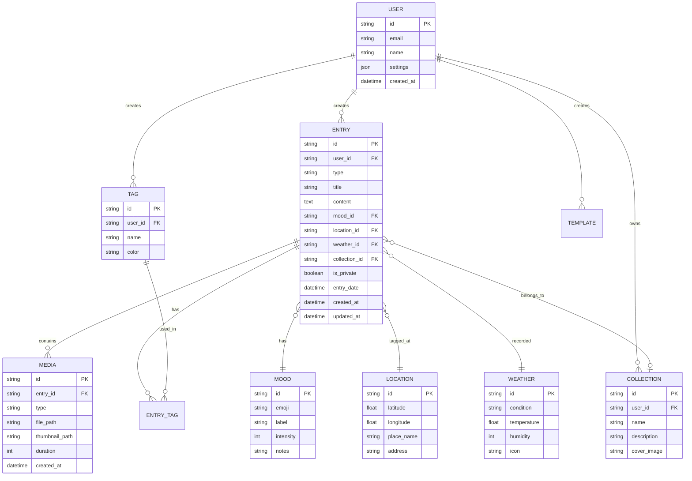
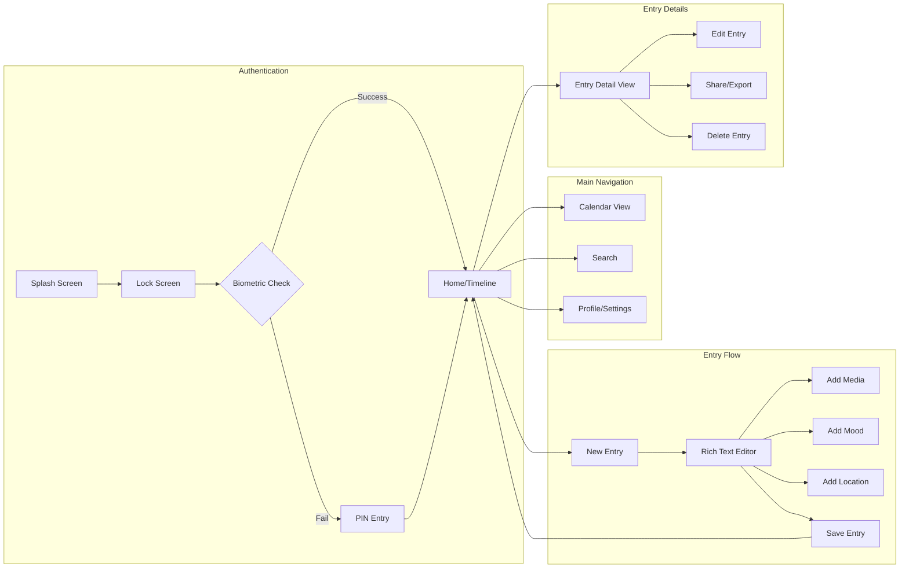

# Personal Diary App - Comprehensive Development Plan

## Project Overview

A modern Personal Diary App built with React Native for iOS and Android, featuring a hybrid local-first architecture with optional cloud sync, biometric authentication, and full multimedia support including location tagging, mood tracking, and weather integration.

---

## Requirements Summary

| Requirement | Selection |
|-------------|-----------|
| **Platform** | React Native (iOS and Android) |
| **Storage** | Hybrid (local-first with optional cloud sync) |
| **Security** | App lock + biometric authentication |
| **Content** | Full-featured with multimedia, location, mood, and weather |

---

## Core Features and Functionalities

### 1. Entry Management

#### 1.1 Entry Types
- **Daily Journal**: Quick daily entries with date-based organization
- **Weekly Reflections**: Summarize the week with prompts and highlights
- **Monthly Reviews**: Long-form entries for monthly retrospectives
- **Stories/Narratives**: Longer creative writing pieces without date constraints
- **Quick Notes**: Short, timestamped thoughts captured on the go

#### 1.2 Rich Text Editor
- Bold, italic, underline, strikethrough formatting
- Headings and subheadings (H1, H2, H3)
- Bullet points and numbered lists
- Blockquotes for memorable quotes
- Text highlighting with multiple colors
- Hyperlink support
- Word count and reading time display

#### 1.3 Multimedia Attachments
- **Photos**: Capture or select from gallery, multiple images per entry
- **Voice Recordings**: In-app audio recording with playback
- **Videos**: Short video clips attachment
- **Drawings/Sketches**: Built-in canvas for hand-drawn illustrations
- **File Attachments**: PDFs, documents for reference

---

### 2. Mood and Wellness Tracking

#### 2.1 Mood Logging
- Visual mood selector (emoji-based or slider scale 1-10)
- Custom mood labels (Happy, Sad, Anxious, Excited, Calm, etc.)
- Mood intensity levels
- Optional mood notes explaining the feeling

#### 2.2 Mood Analytics
- Daily/weekly/monthly mood trends visualization
- Mood calendar heatmap
- Correlation insights (mood vs. activities, weather, etc.)
- Mood history timeline

#### 2.3 Wellness Prompts
- Daily reflection questions
- Gratitude journaling prompts
- Mindfulness check-ins
- Custom prompt creation

---

### 3. Context Enrichment

#### 3.1 Location Tagging
- Auto-detect current location (with permission)
- Manual location search and selection
- Location history on map view
- Travel diary mode with route tracking
- Privacy controls for location data

#### 3.2 Weather Integration
- Auto-fetch weather based on location and time
- Temperature, conditions, humidity display
- Weather icon/emoji in entry metadata
- Historical weather data for past entries

#### 3.3 Date and Time Context
- Automatic timestamp
- Custom date/time selection for backdated entries
- Day of week, season indicators
- Special date markers (holidays, anniversaries)

---

### 4. Organization and Discovery

#### 4.1 Tagging System
- Custom tags/labels for entries
- Tag suggestions based on content
- Tag-based filtering and browsing
- Tag cloud visualization
- Nested tags/categories

#### 4.2 Search Functionality
- Full-text search across all entries
- Filter by date range, mood, tags, location
- Search within attachments (OCR for images)
- Recent searches history
- Saved search queries

#### 4.3 Calendar View
- Monthly calendar with entry indicators
- Day view with entry previews
- Week view for weekly planning
- Year overview with activity heatmap

#### 4.4 Collections/Folders
- Group related entries into collections
- Travel journals, project diaries, themed collections
- Drag-and-drop organization
- Collection covers and descriptions

---

### 5. Security and Privacy

#### 5.1 App Lock
- PIN code protection (4-6 digits)
- Pattern lock option
- Auto-lock timeout settings
- Lock on app switch/background

#### 5.2 Biometric Authentication
- Fingerprint unlock (Touch ID / Android Fingerprint)
- Face recognition (Face ID / Android Face Unlock)
- Fallback to PIN when biometrics fail
- Enable/disable biometrics toggle

#### 5.3 Privacy Features
- Private/hidden entries with extra authentication
- Export data encryption
- Secure deletion with confirmation
- No screenshots mode (optional)
- Incognito mode for sensitive entries

---

### 6. Data Management

#### 6.1 Local Storage
- SQLite database for structured data
- Efficient media file storage
- Automatic local backups
- Storage usage monitoring
- Cache management

#### 6.2 Cloud Sync (Optional)
- User account creation (email/social login)
- End-to-end encrypted sync
- Selective sync (choose what to sync)
- Sync status indicators
- Conflict resolution for offline edits
- Multi-device support

#### 6.3 Backup and Export
- Manual backup to device storage
- Export to PDF (single entry or bulk)
- Export to plain text/markdown
- JSON export for data portability
- Import from other diary apps
- Scheduled automatic backups

---

### 7. Personalization

#### 7.1 Themes and Appearance
- Light and dark mode
- Custom color themes
- Font selection and sizing
- Entry background customization
- Accent color picker

#### 7.2 Templates
- Pre-built entry templates (daily, gratitude, travel, etc.)
- Custom template creation
- Template sharing
- Quick-start templates on new entry

#### 7.3 Widgets
- Home screen widget for quick entry
- Mood tracking widget
- Quote of the day widget
- Streak counter widget

---

### 8. Engagement Features

#### 8.1 Reminders and Notifications
- Daily writing reminders (customizable time)
- Streak notifications
- Memory flashbacks ("On this day" feature)
- Weekly summary notifications

#### 8.2 Streaks and Goals
- Writing streak counter
- Daily/weekly writing goals
- Achievement badges
- Progress statistics

#### 8.3 Memories and Flashbacks
- "On This Day" - entries from past years
- Random memory surfacing
- Memory collections
- Anniversary reminders

---

### 9. AI-Powered Features (Future Enhancement)

#### 9.1 Smart Features
- Auto-tagging suggestions based on content
- Sentiment analysis of entries
- Writing insights and patterns
- Smart search with natural language queries

#### 9.2 Writing Assistance
- Grammar and spell check
- Writing prompts based on mood/context
- Continuation suggestions
- Summary generation for long entries

---

## System Architecture

```mermaid
flowchart TB
    subgraph Mobile App
        UI[React Native UI Layer]
        State[State Management - Redux/Zustand]
        LocalDB[(SQLite + AsyncStorage)]
        MediaStore[Media File Storage]
    end
    
    subgraph Services Layer
        Auth[Authentication Service]
        Sync[Sync Engine]
        Encryption[Encryption Module]
        MediaProc[Media Processing]
    end
    
    subgraph External APIs
        Weather[Weather API]
        Location[Location Services]
        CloudStorage[Cloud Storage - Firebase/Supabase]
        AuthProvider[Auth Provider]
    end
    
    UI --> State
    State --> LocalDB
    State --> MediaStore
    State --> Services Layer
    
    Auth --> AuthProvider
    Sync --> CloudStorage
    Sync --> Encryption
    MediaProc --> MediaStore
    
    UI --> Weather
    UI --> Location
```

---

## Data Model



---

## Screen Flow



---

## UI/UX Components and Screens

### Key Screens

| Screen | Purpose | Key Components |
|--------|---------|----------------|
| **Splash Screen** | App branding, initial load | Logo, loading indicator |
| **Lock Screen** | Security gate | PIN pad, biometric button |
| **Home/Timeline** | Main entry feed | Entry cards, FAB for new entry, filters |
| **Calendar View** | Date-based navigation | Monthly calendar, day entries list |
| **Entry Editor** | Create/edit entries | Rich text toolbar, media picker, mood selector |
| **Entry Detail** | View full entry | Content display, media gallery, metadata |
| **Search** | Find entries | Search bar, filters, results list |
| **Collections** | Organize entries | Collection grid, entry count badges |
| **Mood Analytics** | Visualize mood trends | Charts, calendar heatmap, insights |
| **Settings** | App configuration | Security, sync, themes, backup options |
| **Profile** | User account | Account info, subscription, stats |

### Reusable Components

| Component | Description |
|-----------|-------------|
| `EntryCard` | Preview card showing title, date, mood, excerpt |
| `MoodPicker` | Emoji/slider selector for mood logging |
| `MediaPicker` | Unified picker for photos, videos, audio |
| `RichTextEditor` | Formatted text input with toolbar |
| `TagInput` | Tag creation and selection component |
| `LocationPicker` | Map-based location selector |
| `WeatherBadge` | Weather display with icon and temperature |
| `CalendarHeatmap` | Activity visualization calendar |
| `SearchFilters` | Collapsible filter panel |
| `BiometricPrompt` | Native biometric authentication UI |

---

## Third-Party Integrations and APIs

### Required Dependencies

| Category | Library/Service | Purpose |
|----------|-----------------|---------|
| **Framework** | React Native 0.73+ | Core mobile framework |
| **Navigation** | React Navigation 6.x | Screen navigation |
| **State Management** | Zustand or Redux Toolkit | Global state |
| **Local Database** | WatermelonDB or SQLite | Offline-first storage |
| **Async Storage** | @react-native-async-storage | Key-value storage |
| **Rich Text** | react-native-pell-rich-editor | Text formatting |
| **Media** | react-native-image-picker | Photo/video capture |
| **Audio** | react-native-audio-recorder-player | Voice recording |
| **Drawing** | @shopify/react-native-skia | Sketch canvas |
| **Biometrics** | react-native-biometrics | Fingerprint/Face auth |
| **Location** | react-native-geolocation-service | GPS location |
| **Maps** | react-native-maps | Location display |
| **Charts** | react-native-chart-kit or Victory Native | Analytics visualization |
| **Encryption** | react-native-keychain + crypto-js | Data security |
| **Notifications** | react-native-push-notification | Reminders |

### External APIs

| API | Provider | Purpose |
|-----|----------|---------|
| **Weather** | OpenWeatherMap or WeatherAPI | Current weather data |
| **Geocoding** | Google Maps or Mapbox | Location to address |
| **Cloud Backend** | Firebase or Supabase | Auth, sync, storage |
| **Cloud Storage** | Firebase Storage or AWS S3 | Media file sync |

---

## Implementation Roadmap

### Phase 1: Foundation
- [ ] Project setup with React Native CLI or Expo
- [ ] Configure TypeScript and ESLint
- [ ] Set up navigation structure
- [ ] Implement local database schema
- [ ] Create basic UI theme system
- [ ] Build authentication flow with PIN/biometrics

### Phase 2: Core Entry Features
- [ ] Build rich text editor component
- [ ] Implement entry CRUD operations
- [ ] Create home timeline view
- [ ] Add calendar view navigation
- [ ] Implement basic search functionality
- [ ] Build entry detail view

### Phase 3: Multimedia Support
- [ ] Integrate photo capture and gallery picker
- [ ] Add voice recording functionality
- [ ] Implement video attachment support
- [ ] Build drawing/sketch canvas
- [ ] Create media gallery viewer
- [ ] Optimize media storage and thumbnails

### Phase 4: Context Features
- [ ] Integrate mood tracking system
- [ ] Add location tagging with maps
- [ ] Implement weather API integration
- [ ] Build mood analytics dashboard
- [ ] Create tag management system
- [ ] Add collections/folders feature

### Phase 5: Cloud and Sync
- [ ] Set up cloud backend (Firebase/Supabase)
- [ ] Implement user authentication
- [ ] Build sync engine with conflict resolution
- [ ] Add encrypted cloud backup
- [ ] Implement multi-device sync
- [ ] Create backup/restore functionality

### Phase 6: Polish and Engagement
- [ ] Add reminder notifications
- [ ] Implement streak tracking
- [ ] Build "On This Day" memories feature
- [ ] Create home screen widgets
- [ ] Add export to PDF functionality
- [ ] Implement themes and customization

### Phase 7: Testing and Launch
- [ ] Unit and integration testing
- [ ] Performance optimization
- [ ] Security audit
- [ ] Beta testing
- [ ] App store preparation
- [ ] Launch and monitoring

---

## Technical Considerations and Risks

### Performance Considerations

| Area | Challenge | Mitigation |
|------|-----------|------------|
| **Large Entry Lists** | Slow scrolling with many entries | Virtualized lists (FlatList), pagination |
| **Media Loading** | Memory issues with images/videos | Lazy loading, thumbnail generation, caching |
| **Search Performance** | Slow full-text search | SQLite FTS5, indexed fields, debounced search |
| **Sync Conflicts** | Data conflicts on multi-device | Last-write-wins or manual conflict resolution |
| **Offline Support** | Seamless offline experience | Queue operations, background sync |

### Security Risks

| Risk | Impact | Mitigation |
|------|--------|------------|
| **Data Breach** | Private entries exposed | End-to-end encryption, secure storage |
| **Weak Authentication** | Unauthorized access | Biometrics + PIN, auto-lock timeout |
| **Insecure Backup** | Backup files compromised | Encrypted exports, secure cloud storage |
| **Screenshot Capture** | Sensitive content leaked | Optional screenshot prevention flag |

### Technical Debt Risks

| Risk | Prevention Strategy |
|------|---------------------|
| **Inconsistent State** | Use single source of truth, proper state management |
| **Database Migrations** | Plan schema carefully, use migration tools |
| **Platform Differences** | Abstract platform-specific code, thorough testing |
| **Dependency Updates** | Regular updates, lock versions, monitor deprecations |

---

## Recommended Project Structure

```
src/
├── app/                    # App entry and providers
├── components/             # Reusable UI components
│   ├── common/            # Buttons, inputs, cards
│   ├── entry/             # Entry-related components
│   ├── media/             # Media handling components
│   └── charts/            # Analytics visualizations
├── screens/               # Screen components
│   ├── auth/              # Lock, PIN screens
│   ├── home/              # Timeline, calendar
│   ├── entry/             # Editor, detail views
│   ├── search/            # Search and filters
│   └── settings/          # Settings screens
├── navigation/            # Navigation configuration
├── store/                 # State management
├── database/              # Local database setup
│   ├── models/            # Data models
│   ├── migrations/        # Schema migrations
│   └── queries/           # Database queries
├── services/              # Business logic
│   ├── auth/              # Authentication
│   ├── sync/              # Cloud sync
│   ├── media/             # Media processing
│   └── api/               # External API clients
├── hooks/                 # Custom React hooks
├── utils/                 # Helper functions
├── constants/             # App constants
├── theme/                 # Styling and themes
└── types/                 # TypeScript definitions
```

---

## Next Steps

1. **Set up the React Native project** with TypeScript and required dependencies
2. **Implement the database schema** using WatermelonDB or SQLite
3. **Build the authentication flow** with PIN and biometric support
4. **Create the core entry management** features (CRUD operations)
5. **Iterate through the phases** as outlined in the roadmap

---

*Plan created: December 10, 2025*
